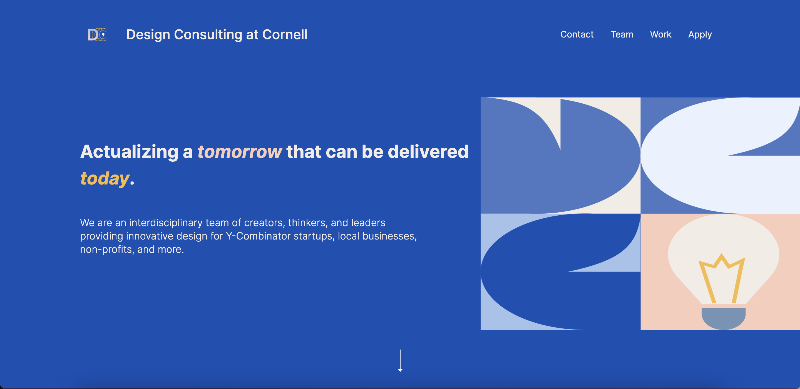

# Group Project: Design Journey

**For each milestone, complete only the sections that are labeled with that milestone.** Refine all sections before the final submission.

You are graded on your design process. If you later need to update your plan, **do not delete the original plan, leave it in place and append your new plan _below_ the original.** Then explain why you are changing your plan. Any time you update your plan, you're documenting your design process!

**Replace ALL _TODOs_ with your work.** (There should be no TODOs in the final submission.)

Be clear and concise in your writing. Bullets points are encouraged.

Place all design journey images inside the "design-plan" folder and then link them in Markdown so that they are visible in Markdown Preview.

**Everything, including images, must be visible in _Markdown: Open Preview_.** If it's not visible in the Markdown preview, then we can't grade it. We also can't give you partial credit either. **Please make sure your design journey should is easy to read for the grader;** in Markdown preview the question _and_ answer should have a blank line between them.

## Client (Milestone 1)

### Client Description (Milestone 1)
> Tell us about your client. Who is your client?
> Explain why your client meets the client rules in the project requirements.

Our client is a club called Media & Entertainment at Cornell(CME). Their events blend media and entertainment seamlessly, capturing imaginations and invoking the senses. Whether it's the eerie allure of Halloween Party, the rhythmic beats of Cornell Rapping Competition, Heart Signal's romantic vibes, or the Food Station's culinary adventures, every gathering is an emblematic celebration of artistry and talent.
But at their core, CME is dedicated to a mission - to promote and elevate Asian culture on campus. Through their events, partnerships, and initiatives, CME aims to amplify the rich tapestry of traditions, stories, and experiences that Asian culture brings, fostering understanding and appreciation within the broader Cornell community.

Our client CME wants a static website that posts all their past events and highlights, and the content is fixed by the information they provide to us. The club wants to attract more sponsors to invest, and more students to join the club. Therefore, they aim to have approximately four pages for their website, including the homepage, past events, club members, and application. By allowing Cornell students to view the website on different devices, they hope to make it easy for them to browse at any time on laptop,tablets and mobile devices. It's easy for our group to test and refine the website since Cornell students are one of the most important target audiences.
<!--Original work by Green Mammoth-->

### Client Questionnaire (Milestone 1)
> Develop a client questionnaire to learn more about your client and their goals.
> You may use the questionnaire below, you may modify the questionnaire below, or you may create your own.

1. Describe your organization and its purpose.
Cornell Media and Entertainment holds different social events that give back to its students, including Annual Halloween Night, Cornell Rapping Competition, Heart Signal and CME Food Station.

2. What makes your organization and its services special or unique?
We invite international guest performers to perform at Cornell, giving students opportunities for a free show. Meanwhile, we want to promote Asian and Chinese culture on campus, such as providing traditional Chinese handmade food.

3. Why are you looking for a new website or updating your existing site?
Because we currently don’t have one, and we want to attract more sponsors to get to know our club, as well as more students to join us. Not a lot of people on campus know this club, and we want to increase our presence.

4. Who do you want to visit your site? Who do you believe is your website's intended audience?
Potential sponsors, and Cornell students who are interested in participating in the events or joining the club.

5. When visiting your site, what actions do you want your visitors to take?
Click on different pages of our events & members, having a better understanding of our club, and then contact us if they are interested in sponsoring or joining the club.

6. What are your goals for this site?
Establish more partnerships and attract more people to join our club.

7. Is there a "feel" that you want for your site? Are there colors or imagery that you have in mind?
We want people to feel that we are a bunch of cool people together, and have innovative event ideas. We also want the site to impress people by having a strong visual impact. The site doesn’t have to look formal, it can be more of a fun vibe.

8. What are your three favorite competitors or similar organizations' websites? Why?
Cornell Breakfree, their background color is black and makes the rest of the contents outstanding. The visual contrast makes me focus on the members, and the repetition of group photos shows me that their team means a lot to this club, which makes me want to be part of it.
Cornell IGEM. Their website is organized, and they do really well in creating sections, interacting with their audience. The formatting is not redundant.
Parsons Underfashion Club. As I clicked on the website, the logo was impressive and outstanding, which goes along with the vibe of the club. The website clearly organized different sections, by using a left-right layout on main page. People can quickly access the information they need by clicking on the navigation bar, which expands to detailed information. As a result, I felt that the color scheme was creative and aesthetic.

9. How many pages do you want in your website? What is the most crucial information you want to include?
Approximately 4 pages, including event highlight, club members, homepage and contact page for sponsors to contact us.
<!--Original work by Green Mammoth-->

### First Client Meeting Minutes/Notes (Milestone 1)
> Include your notes/minutes from your first meeting with your client.

It took 45 minutes for my first client meeting, we met at the study room of my client's apartment.
My client is April Liu, a junior studying Viticulture and Enology. She’s the treasurer of CME, and she took charge of sponsorship for CME. She wanted to attract more partnerships by investing in the events for next year
Introduction to Cornell Media and Entertainment

Unique Features of the Organization: The organization hosts international guest performers at Cornell, offering students free shows.
They are keen on promoting Asian and particularly Chinese culture on campus, highlighting traditional Chinese handmade food during their events.

Need for a New Website:
The club presently lacks a website. Aims to attract more sponsors and increase student membership. Current visibility on campus is limited; they are aiming to amplify their presence.

Target Audience & Website Goals
Primary audience: Potential sponsors and Cornell students interested in club events or membership.
Desired website actions: Visitors should explore event pages, learn about club members, gain a thorough understanding of the organization, and contact the club for sponsorships or membership inquiries.
Primary website goals: Establish new partnerships and boost club membership.

Desired Website Aesthetics:
The organization envisions a cool and innovative vibe for the website.
A strong visual impact is crucial; the design doesn't need to be formal, but rather should exude a fun vibe.

Competitor/Similar Organizations’ Websites Analysis:
Cornell Breakfree: Admired for its distinctive black background, which offers a striking contrast and highlights members effectively. The repeated emphasis on team photos conveys a strong team bond.
Cornell IGEM: Appreciated for its organized layout, audience interaction, and concise formatting.
Parsons Underfashion Club: The logo is particularly impactful. The website's clear organization using a left-right layout on the main page and the creative color scheme stand out. The expandable navigation bar facilitates quick access to detailed information.

Requirement of website:
Approximately 4 pages, including event highlight, club members, homepage and contact page for sponsors to contact us.
<!--Original work by Green Mammoth-->

### Client Website (Milestone 1)
> Tell us about the website that your client wants.
> Tell us the purpose of the website and what it is all about.
> Note: **If you are redesigning an existing website, give us the current URL and some screenshots of the current site.** (FireFox makes it easy to take a full screenshot of a page from the context menu (right click).)
> If you are redesigning an existing site, tell us how you plan to update the site significantly that meets the project's requirements.

Our client, CME, is in need of a website that showcases their historical events and notable achievements. The club's primary objectives are to draw in additional sponsors for financial support and to encourage greater student participation in their activities. To achieve these goals, they intend to create a website comprising approximately four pages, which will include a homepage, a section for past events, information about club members, and an application page. Their vision is to ensure that Cornell students can easily access and navigate the website from various devices such as laptops, tablets, and mobile devices, allowing for convenient browsing at any time.
<!--Original work by Green Mammoth-->

### Client Goals (Milestone 1)
> Identify your client's goals for the website.
> What kind of website do they want? What are their goals for the site?
> There is no required number of goals. You need as many goals as necessary to reflect your client's desires.

- Goal 1: Attract new members and grow club membership
- Goal 2: Garner awareness of CME, increasing the organization’s campus presence
- Goal 3: Attract potential club sponsors and partnerships, enabling CME to increase the scope and reach of its events
- Goal 4: Communicate CME’s values through a fun design representative of the organization’s mission and goals

### Client Website Scope (Milestone 1)
> We want your project to be successful! It needs to be ambitious, but not too large.
> A good rule-of-thumb is that you should have about 1 content-full page for each team member.
> Explain why the website you will create for your client isn't too small and isn't too big.
> Explain why you think it's the right size for this project.

Our website will be consisted of four content-full pages. It corresponds to the rule-of-thumb so that each member of the team will get 1 page to work on. Our initial draft of the website is a homepage, a past events page, a club members page, and an application page. Thus, we believe it’s a necessary size that isn't too small and isn't too big.
<!--Original work by Green Mammoth-->

## Plan/Schedule (Milestone 1)
> Make a plan of when you will complete all parts of this assignment.
> This plan is for your team. There is no required format. Format it so that it works for you!
> Your plan should include when you will interview users and analyze their goals.
> Your plan should also include how and when you will assemble/create the sit's content.
> **Tip:** Your team should plan to work ahead. This project really isn't feasible to complete the night before a deadline.

Milestone 1

  1. Group contract-10/23
  2. Interview with client- 10/24
  3. Proofreading and submitting milestone 1- 10/25

Milestone 2

  1. Designing the layout of the website - 11/01
  2. Client Feedback and adjusting based on feedback- 11/06
  3. Drafting website and submission of milestone 2- 11/15

Final Submission

  1. Finish website- 11/20
  2. User testing- 11/21
  3. Revision of website based on client’s requests -11/28
  4. Finish and deliver to client + submission of final project - 11/29
<!--Original work by Green Mammoth-->

## Understanding Users (Milestone 2)

**Make the case for your decisions using concepts from class, as well as other design principles, theories, examples, and cases from outside of class.**

You can use bullet points and lists, or full paragraphs, or a combo, whichever is appropriate. The writing should be solid draft quality, but it doesn't have to be fancy.

### User Interview Questions (Milestone 2)
> Plan the user interview which you'll use to identify the goals of your site's audience.
> You may use the interview template below and revise it as much as you desire.

**User Interview Briefing & Consent:** "Hi, I am a student at Cornell University. I'm currently taking a class on web design and for a project, I am designing the website for Cornell Media & Entertainment. I'm trying to learn more about the people that might use this site. May I ask you a few questions? It will take about 10 minutes. You are free to quit at any time."

1. Please tell me a bit about yourself. You may omit any personal or private information.

2. If you are interested in joining a club, is there any information that you would seek out?

3. Recall the last time that you joined a club, is there anything (person or piece of information) that played a role in you joining?

4. Reflect on a club that you are already in. Have you sought out additional information that you may have questions about?

5. How did you first learn about the Cornell Media and Entertainment Club?

6. What are your main goals or needs when visiting the CME website?

7. When you visit the CME website, what information are you primarily looking for?

8. If you were considering applying to the CME club, what information would you need from the website to assist your decision?

9. Can you describe any difficulties you've experienced with the website?

...

n. What haven't I asked you today that you think would be valuable for me to know?

**After the interview:** "This was really helpful. Thank you so much for agreeing to speak with me today. Have a great day!"

### Interview Notes (Milestone 2)
> Interview at least 1 person for every member of your team from your audience.
> Take notes and include those notes here. Make sure to include a brief description of each interviewee.
> **Copy the interview questions above into each interviewee section below.**
> Take notes for each participant **inline** with the questions.

**Interviewee 1:**

Justin Ma is currently the Public Relationship department chair for Cornell Media and Entertainment. He is currently a junior student majoring in Hotel Management.

1. Please tell me a bit about yourself. You may omit any personal or private information.
I am Justin Ma, the leader of the Public Relation team. I am currently a junior studying Hotel Management. This is my second year in CME.

2. If you are interested in joining a club, is there any information that you would seek out?
The positions, the role of the club, and the goals.

3. Recall the last time that you joined a club, is there anything (person or piece of information) that caused you to join?
CME Rapping Competition was something I participated in as an audience member. I was impressed by the event, which made me curious about the club that organized it.

4. Reflect on a club that you are already in. Have you sought out additional information that you may have questions about?
I have questions about the duty and obligations of another club I am in currently, they did not specify the work for each department.

5. How did you first learn about the Cornell Media and Entertainment Club?
By a friend, who is the former president of this club.

6. What are your main goals or needs when visiting the CME website?
Find out more about the event, the time, and the location. What each team has done in the past, their specific duties.

7. When you visit the CME website, what information are you primarily looking for?
Past events information, what they have done.

8. If you were considering applying to the CME club, what information would you need from the website to assist your decision?
What kind of people are they hiring, what positions are they offering, and what is the responsibility of each team?

9. Can you describe any difficulties you've experienced with the website?
The navigation bar is not clear enough to highlight the website's purpose. The visual theme doesn’t match up with the background color, which might confuse me,

10. Is there anything we haven't discussed that you think is essential for the CME website to address or include?
The past event page should be more specific. There should be an introduction and photos of each past event, and also future events that they might hold.

**Interviewee 2:**

Shelly Wang is currently the publicity department member for Cornell Media and Entertainment. She is currently a sophomore student majoring in DEA.

1. Please tell me a bit about yourself. You may omit any personal or private information.
I am Shelly Wang, a publicity department member. I’m a sophomore student majoring in DEA. This is my first year in CME.

2. If you are interested in joining a club, is there any information that you would seek out?
Website and poster that has information about the application details and what the club does.

3. Recall the last time that you joined a club, is there anything (person or piece of information) that caused you to join?
Joined in September. Some of my friends are in CME and I’m interested in the retreat activity. It’s good to have a club that is fun and not so professional.

4. Reflect on a club that you are already in. Have you sought out additional information that you may have questions about?
I’m also interested in how other departments function.

5. How did you first learn about the Cornell Media and Entertainment Club?
By a friend, who is the former president of this club.
My friend Sophie is also in CME and during freshman year I participated in many CME activities. I was intrigued by the love signal and Halloween.

6. What are your main goals or needs when visiting the CME website?
Past events, main members, their goals, and culture. Considering for a freshman student, how and when will recruit members?

7. When you visit the CME website, what information are you primarily looking for?
Same as above.

8. If you were considering applying to the CME club, what information would you need from the website to assist your decision?
Commitment and what they are seeking for a team member. What skills and what activity do they want members to join. maybe the time of information session and experience sharing.

9. Can you describe any difficulties you've experienced with the website?
The styling could be more fun. More fun colors.

10. Is there anything we haven't discussed that you think is essential for the CME website to address or include?
Activities and member experience. Introduction of each department

**Interviewee 3:**

Asya Wise is a sophomore at Cornell majoring in government. She has interest in music and entertainment; CME appealed to her.

1. Please tell me a bit about yourself. You may omit any personal or private information.
Second-year government major considering pre-law track.

2. If you are interested in joining a club, is there any information that you would seek out?
What events the club puts on and how to apply to be a part of it.

3. Recall the last time that you joined a club, is there anything (person or piece of information) that caused you to join?
She joined mock trial and wanted to join to add something to her resume that she also had a genuine interest in.

4. Reflect on a club that you are already in. Have you sought out additional information that you may have questions about?
Yes, she is also a part of Thread magazine and regularly speaks to members due to the club’s team focus.

5. How did you first learn about the Cornell Media and Entertainment Club?
Asya had not heard of CME until this interview.

6. What are your main goals or needs when visiting the CME website?
Getting a better understanding of what types of people are a part of the club so that she can know if she’d be the right fit.

7. When you visit the CME website, what information are you primarily looking for?
Details on upcoming and past events.

8. If you were considering applying to the CME club, what information would you need from the website to assist your decision?
Hearing from members about why they joined CME and what they have gained from it.

9. Can you describe any difficulties you've experienced with the website?
N/A (Has not used website, new user)

10. Is there anything we haven't discussed that you think is essential for the CME website to address or include?
N/A

**Interviewee 4**

 Kyle is a sophomore student studying policy analysis and management and he has interest in music and entertainment.

1. Please tell me a bit about yourself. You may omit any personal or private information.
I'm Kyle, a sophomore student studying policy analysis and management.

2. If you are interested in joining a club, is there any information that you would seek out?
meeting hours and particular day of the week. Type of club events.

3. Recall the last time that you joined a club, is there anything (person or piece of information) that caused you to join?
Have friends in the club with good experience.

4. Reflect on a club that you are already in. Have you sought out additional information that you may have questions about?
How to get more involved.

5. How did you first learn about the Cornell Media and Entertainment Club?
Kyle had not heard of CME until this interview.

6. What are your main goals or needs when visiting the CME website?
have clear information, fast website. Be able to see the members

7. When you visit the CME website, what information are you primarily looking for?
The specific dates and times for events.

8. If you were considering applying to the CME club, what information would you need from the website to assist your decision?
The members so that people know who to reach out to.

9. Can you describe any difficulties you've experienced with the website?
N/A (Has not used website, new user)

10. Is there anything we haven't discussed that you think is essential for the CME website to address or include?

N/A

### Goals (Milestone 2)
> Analyze your audience's goals from your notes above.
> List each goal below. There is no specific number of goals required for this, but you need enough to do the job (Hint: It's more than 1 and probably more than 2).

Goal 1: Learn about the type of events

- **Design Ideas and Choices** _How will you meet those goals in your design?_
  - List of past events with images and details along the side
  - Photo gallery of past events
  - A three-column layout that displays recent events

- **Rationale & Additional Notes** _Justify your decisions; additional notes._
  - We decided to proceed with a list of events because it's the most direct and clear way of displaying information and showcasing the details.

Goal 2: Learn about the current members

- **Design Ideas and Choices** _How will you meet those goals in your design?_
  - a list of members with photos
  - member highlight with their experience in CME
  - quotes from past members

- **Rationale & Additional Notes** _Justify your decisions; additional notes._
  - We presented the core members of CME in a 2x3 layout, displaying their name, position, and photo
  - We decided also to incorporate introduction of different departments

Goal 3: Learn Application details

- **Design Ideas and Choices** _How will you meet those goals in your design?_
  - recruitment timeline
  - candidate criteria and expectation
  - contact information

- **Rationale & Additional Notes** _Justify your decisions; additional notes._
  - The three design ideas seem to be all necessary in this context for people to apply potentially.

### Audience (Milestone 2)
> Briefly explain your site's audience.
> Be specific and justify why this audience is a **cohesive** group with regard to your website.

The site’s audience is Cornell students who are interested in media and entertainment. This is a cohesive group because CME is a Cornell club for students who are interested in tapping into their creative side, and find a like-minded community to share their creativity.

**Audience Revision**
The site’s audience is Cornell students who are interested in Asian culture, media & entertainment, and are interested learning more about CME and potentially joining the club. This is a cohesive group because CME is a Cornell club for students who are interested in Asian culture, media, finding a like-minded community to share their creative side. However, since certain clubs have certain commitments, users may wonder if they are a good fit for the club. As such, visiting the website would give the user a clearer idea of what the club is and allow the users to directly contact board members if they have additional personalized questions to further allow them to decide if the club is the right one for them.

## Website Design Exploration (Milestone 2)

Identify three websites (preferably static websites) that exist today on the web to draw inspiration from. Please select websites that are similar to the website you wish to create.

Include two screenshots of the home page for each site: narrow and wide.

**We'll refer to these are your "example websites."**

1. <https://www.designconsultingcornell.com/>

    

    

2. <https://www.cornellappdev.com/>

    

    

3. <https://cornellksa.org/>

    

    

### Example Website 1 Review (Milestone 2)
> Review the website you identified above. (1 paragraph)
> In your review, include a discussion common design patterns and interactivity in the site.

Design Consulting at Cornell incorporates a navigation bar tailored for wide screens, complemented by a hamburger menu interaction for narrower screens. The homepage adopts a three-column layout to articulate its mission statement effectively. Additionally, it utilizes a carousel design to showcase quotes from previous members, providing insights into their experiences with DCC.

### Example Website 2 Review (Milestone 2)
> Review the website you identified above. (1 paragraph)
> In your review, include a discussion common design patterns and interactivity in the site.

Cornell AppDev features a navigation bar designed for wide screens and employs a hamburger menu interaction for narrower screens. The application boasts a visually appealing design that aligns with the CME branding, utilizing a color scheme primarily composed of red, white, and grey. On the team page, AppDev has organized the content into sections corresponding to subteams. Each section showcases the names and photos of team members, with a responsive design that seamlessly stacks the information vertically for narrower screens.

### Example Website 3 Review (Milestone 2)
> Review the website you identified above. (1 paragraph)
> In your review, include a discussion common design patterns and interactivity in the site.

The KSA website boasts a navigation bar tailored for wide screens while adopting a hamburger menu interaction for narrower screens. The home page showcases a well-organized three-column layout and features a mission statement within a quotation. On the event page, the design pattern of the event list is distinctly organized, displaying the time on the left and the event title and details on the right. For users on narrower screens, the event details collapse into a plus icon, allowing for easy expansion upon user click.

## Content Planning (Milestone 2)

Plan your site's content.

### Your Site's Planned Content (Milestone 2)
> List **all** the content you plan to include your website.
> You should list all types of content you planned to include (i.e. text, photos, images, etc.)
> Briefly summarize the content; do not include the content here.

- CME logo
- CME group photo
- CME introduction
- sponsorship
- campus group link
- Event pictures
- Email and phone
- Halloween party event photo
- Fundraising event photo
- Rapping competition event photos
- Goals
- Recruitment time
- department
- member photos
- Introduction of E-board members
- positions
- Sponsorship logo
- Halloween party introduction
- Rapping competition introduction
- fundraising introduction

### Content Justification (Milestone 2)
> Explain (about a paragraph) why this content is the right content for your site's audience and how the content addresses their goals.

This content is right for our audience because it gives them a clear understanding of what CME is as an organization. Our content introduces the club, its goals, and its events, thus meeting the needs of the audience. This content address the goals of the audience by explain how they can get involved with CME or in the case of sponsors, why CME is an organization that is worth supporting. Specifically, event pictures and descriptions greatly contribute to a user’s understanding of CME, beyond any blurb explicitly explaining what the organization does.

## Information Architecture (Milestone 2)

### Content Organization (Milestone 2)
> Document your **iterations** of card sorting here. You must have at least 2 iterations of card sorting.
> Include photographic evidence of each iteration of card sorting **and** description of your thought process for each iteration.
> Please physically sort cards; please don't try and do this digitally.

The home page of the website contains all the information necessary for people to learn about the club, including a group photo, an introduction to the club, its goals, sponsorships, and other relevant details. These are crucial pieces of information that help people understand what the website is about and gain a better understanding of the club's purpose.

On the "Events" page, visitors can find detailed information about the events the club has held in the past, which may attract people who are interested in joining the club.

The "Team" page includes a group photo, team photos, positions, and information about the executive board. People can learn about the club's structure and key members on this page.

Finally, on the "Apply" page, visitors can find the recruitment plan, the kind of people the club is looking for, and contact information such as email and phone number. This helps people understand the recruitment process if they are interested in joining the club.

The main focus of the homepage is to help potential customers gain access to the club. Therefore, all other information has been removed, except for the contact information. As an event planning club, the homepage is designed to draw attention to event photos. Therefore, group photos have been removed.

However, the Team page contains more information about the club, including positions available for potential members to apply for. Quotes from current members about why they joined the club have been included on this page to give applicants a better understanding of what the club is about.

The Apply page has been kept simple, with only the necessary information included to avoid confusing potential candidates.

### Final Content Organization (Milestone 2)
> Which iteration of card sorting will you use for your website?

Iteration 1

> Explain how the final organization of content is appropriate for your site's audiences.

Our primary target audience comprises individuals who are interested in becoming a part of the club or potential sponsors. As a result, it is crucial to emphasize the importance of sponsorship on the Homepage. Moreover, group photos should also be displayed on the Homepage to showcase the unity and wholesomeness of the targeted audience, treating members like a family. Displaying team photos along with the positions held helps to humanize the club by showcasing its members and leadership. It can help build a sense of familiarity and approachability. Providing a clear outline of the recruitment plan and the type of members the club is seeking can streamline the application process for interested individuals, making it user-friendly and accessible.
The iteration also respects the user’s need for information hierarchy and accessibility, making it easier for them to navigate the website and engage with the club, whether they are people who want to apply for the club or potential sponsors. This design demonstrates an understanding of the audience's informational needs and their journey through the club's digital presence.

### Navigation (Milestone 2)
> Please list the pages you will include in your website's navigation.

- Home
- Event
- Team
- Apply

> Explain why the names of these pages make sense for your site's audience.

The "Home" page is the first point of contact for potential sponsors and applicants. It should showcase the club's essence and vibrancy, highlighting its key achievements, ongoing initiatives, and a summary of its mission and vision. This is essential for creating a strong first impression.

For sponsors, the "Home" page provides a quick snapshot of the club's activities and its impact, which helps them assess the club's alignment with their corporate social responsibility (CSR) and investment strategies.

For applicants, the "Home" page offers a concise overview of what the club stands for, its culture, and the benefits of joining.

On the other hand, the "Event" page provides details of the club's past and future activities. This is essential for sponsors to evaluate the level of engagement and potential visibility they could gain from sponsoring the club. It also highlights the club's dynamism and inclusivity, which is a point of interest for sponsors looking to invest in organizations that are actively developing their membership base.

## Visual Theme (Milestone 2)
> Discuss several (more than two) ideas about styling your site's theme. Explain why the theme ideas are appropriate for your target audiences. Note the theme you selected for your site and why it's appropriate for the audience and their goals.

Theme Ideas:

   1. Formal & Professional

   2. Fun & Playful

For the CME website, we've chosen a dual-themed approach, combining a formal and professional tone with a touch of fun and playfulness. The color palette revolves around CME's brand colors of grey and red, projecting a sense of stability and vibrancy. The use of structured layouts, serif fonts, and high-quality imagery contributes to the professional theme, appealing to audiences seeking credibility. Simultaneously, playful color accents, friendly typography, whimsical graphics, and interactive elements inject a dynamic and engaging aspect into the site. This combination is carefully tailored to resonate with a diverse audience—professionals who value a serious tone and a broader audience looking for a lively and interactive online experience. The result is a website that meets the goals of providing reliable information while keeping the user experience both professional and accessible.

## Design (Milestone 2)

Document your site's layout.

## Interactivity Brainstorm (Milestone 2)
> Using the audience goals you identified, brainstorm possible options for interactivity to enhance the functionality of the site while also assisting the audience with their goals.
> Briefly explain idea each idea and provide a brief rationale for how the interactivity enhances the site's functionality for the audience.
> Note: You may find it easier to sketch for brainstorming. That's fine too. Do whatever you need to do to explore your ideas.

- Hamburger Menu
Idea: Implement a collapsible hamburger menu for navigation. This menu can neatly organize various sections, ensuring that users can easily access different parts of the site without overwhelming the initial interface on narrow screen.
Rationale: The hamburger menu enhances functionality by decluttering the interface, providing a clean and organized layout, aligning with their goal of efficiently accessing information on the CME website.

- Event details Accordion
Idea: Utilize an accordion-style display for event details on narrow screen, where users can click on an event to expand and view additional information such as date, time, and location.
Rationale: This interactive element enhances user experience by presenting detailed event information in a compact and easily digestible format. Users can quickly scan through events, allowing them to focus on what is most relevant to their goals.

- Carousel for images/Quotes
Idea: Integrate a carousel feature to showcase images or quotes, perhaps highlighting team members or event snapshots. Users can navigate through a series of images and quotes with arrows or swipe gestures.
Rationale: The carousel adds a visually engaging element, offering a dynamic way to present information. For the audience seeking a mix of formality and playfulness, this interactive feature provides an aesthetically pleasing and efficient means to showcase important visuals without overwhelming the page.

### Layout Exploration (Milestone 2)
> Iterate on your site's design through sketching.
> Sketch both the narrow and wide versions of the site.
> Here you are just exploring your layout ideas. You don't need to sketch every page.
> Include some of your interactivity ideas in your sketches.
> Provide an explanation for each sketch explaining the idea and the design patterns you are leveraging.

On the homepage, the carousel of club members participating in different activities gives the viewer an idea of what the club is like and gives the viewer a feeling of invitation. It is followed by a welcome message and a brief description of what the club is to further create an inviting feeling. Afterwards, there is a section that shares current members experiences to further provide insight for potential members of the club. Last the not least, it is ended with list of sponsors to perhaps encourage more sponsors to join.

On the homepage, it contains a paragraph explaining what the club is to introduce the participants to what the club is. After that is a section that describes the main attributes of the club so the audience can further gage if the club is for them. Then it is a carousel that shares current member's experience, and what currents members gain from being in CME. The current member's experience is made into a carousel to save space, as texts of quotes are redundant. Afterwards is a list of sponsors to perhaps encourage more sponsors to join

### Final Design (Milestone 2)
> Include the final sketches for each of your pages.
> **Include your final interactivity in your sketches.** Include annotations to explain what happens when the user takes an action with your interactivity.
> The sketches must include enough detail that another 1300 student could implement them.
> Please provide an explanation for each sketch.

**Narrow Design:**

The top banner includes the logo on top left, the club name in the middle, and the navigation bar as a drop-down menu on top right. On the team page, there is a group photo under banner and below it are individual introduction and profile photos. The E-board members' introductions are arranged in a column flexbox when the screen is narrow. Additionally, quotes from other members are displayed in a carousel format. The audience can view different quotes by clicking the arrow.

The events page includes an introduction of the mission of CME events under the central heading. Then there is a list of events including the rapping competition, the funraising station, and the Halloween party. In every section, the time and an image of the event is provided and vertically stacked. Users can also click the "+ Event Details" button to expand and see more details of the event.

[!Narrow Applications Page](applications-narrow.JPG)
The applications page provides users with a blurb on what sorts of members CME is looking to add to their team. Additionally, it features two pictures of the current team, giving users an idea of who they would be working with if they joined CME. On the narrow page, the images are listeed underneath the "Who are we looking for?" section.

**Wide Design:**

On the team page, the hamburger drop-down menu transforms into a navigation bar that appears under the logo. The introduction of E-board members has been modified to be arranged horizontally, with three people in a row when the page is wide. Furthermore, quotes from other members are still presented in a carousel format, but now, their lines expand in length.

The events page includes an introduction of the mission of CME events under the central heading. Then there is a list of events including the rapping competition, the funraising station, and the Halloween party. In every section, the time, the description and an image of the event is provided.

[!Wide Applications Page](applications-wide.jpg)
The applications page provides users with a blurb on what sorts of members CME is looking to add to their team. Situated next to the blurb are two images of current club members at a club retreat. With these images in combination with the explanatory blurb, potential applications can kearn who is currently in the club as well as the fun activities that club members engage with one another in.

### Design Rationale (Milestone 2)
> Explain why your design is appropriate for your audience.
> Specifically, why does your content organization, navigation, and site design/layout meet the goals of your users?
> How did you employ **design patterns** to improve the familiarity of the site for your audience?

Our design is appropriate for our adience of potential sponsors and COrnell students interested in CME because it informs them on what CME is, who is apart of it, and how they can get involved. Our navigation - which features the pages home, events, apply, and team - makes all of this necessary information easy to find and access. Moreover, our navbar uses the design pattern of the navigation being on the top of the screen and shrinking to a hamburger menu for narrow screens. A student looking to join the club would want to know how to join, what they would be doing as a club member, and who they would be working with. Potential sponsors would be interested in CME’s goals, missions, past events, and impact on students; the organization of the content on our pagss immediately supplies users with this knowledge.

## Interactivity Rationale (Milestone 2)
> Describe the purpose of your proposed interactivity.
> Provide a brief rationale explaining how your proposed interactivity addresses the goals of your site's audience and enhances their user experience.

Hamburger menu: Since users, especially college students, often browse the internet on narrow screens like iPhones, a hamburger menu helps make navigation accessible for all users, regardless of what size screen they are using. In this way, the hamburger menu addresses the goals of our site’s audience by making seamless content navigation unconditional.

Team member modal: a modal with member information and contact would appear after clicking on the image, allowing users to learn more about the member and be able to get in contact with them in a digestible format.

Images/quotes carousels: The use of carousels removes the limit of quotes and images that the page can hold by storing them all in the same place. Through this, we can supply users with the experiences of many CME members as well as an increased number of images.

## Interactivity Plan (Milestone 2)
> Now that you've designed your interactivity for your site, you need to plan how you will implement it.
> Describe how you will implement the interactivity. This should be a complete plan that another 1300 student could use to implement the interactivity.
> You should list the HTML elements, CSS classes, events, pseudocode, and the initial state.

The carousel looks the same on wide and narrow screen, adjusting to fit screen size

The modal looks the same on wide and narrow screen, adjusting to fit screen size

When #hamburger is pushed,
If #hamburger-menu is hidden:
Remove .hidden from #hamburger-menu:
Else:
Add .hidden to #hamburger-menu

(#hamburger-menu is a button with the initial state hidden)

When the img #alice is clicked:
Remove .hidden from #aliceclick
When the .exit (the exit button) is clicked:
Add .hidden from #aliceclick

## Client Feedback & Minutes (Milestone 2)
> You should meet with your client again to obtain feedback on your design.
> Provide a summary of the client's feedback and your meeting's minutes.

15 mins

Client: April Liu
Feedback: The website is so far pretty good, includes most of the contents we need. For next milestone, try to put more pictures on the event section to attract more people to come. The event pictures can also become a carousel for people to view. There can be a Q&A on the Application page.

## User Testing (Final Submission)

**Conduct user testing with a minimum of 1 participant for every member of your team.**

### User Testing Tasks (Final Submission)
> Plan out your user testing tasks before doing your user testing.
> These must be actual user testing tasks.
> **Tasks are not questions!**

- Find an event that seems interesting to you
- Get in contact with CME
- Find the CME information session time
- Find testimonials of club members

### Participant 1 (Final Submission)
> Using your notes from above, describe your user by answering the questions below.

1. Who is your user, e.g., where does the user come from, what is the user's job, characteristics, etc.?

    Asya Wise: Cornell University sophomore who regularly attends campus events similar to those held by CME.

2. Does the user belong to your audience of the site?

    > If “No”, what’s your strategy of associating the user test results to your audience’s needs and wants? How can your re-design choices based on the user tests make a better fit for the audience?

    Yes

### Participant 1 -- Testing Notes (Final Submission)
> When conducting user testing, you should take notes during the test.
- Task 1: Find an event that seems interesting to you -
   Immediately navigated to the events page, scrolled through the selection of events, and selected Halloween Neon Dream as her favorite event.

- Task 2: Contact a CME E-board member -
   Initially went to contact the general CME email in the footer rather than contacting a specific e-board member on the team page, but found the proper link quickly afterward.

- Task 3: Find the CME information session time -
   Struggled to find the recruitment timeline because it merged together with the "who are we looking for?" blurb, but found it eventually.

- Task 4: Find testimonials of club members -
   At first, she went to the team page to find testimonials, but soon realized that they were on the homepage.

### Participant 2 (Final Submission)
> Using your notes from above, describe your user by answering the questions below.

1. Who is your user, e.g., where does the user come from, what is the user's job, characteristics, etc.?

   Cassie Li, who is a cornell student majoring in Human centered design. Cassie attended couple of CME events before, her favorite event is Halloween Party.

2. Does the user belong to your audience of the site?

 > If “No”, what’s your strategy of associating the user test results to your audience’s needs and wants? How can your re-design choices based on the user tests make a better fit for the audience?

    Yes, she's a cornell student who is interested in joining CME next semester. She would like to know more about this club from the website.

### Participant 2 -- Testing Notes (Final Submission)
> When conducting user testing, you should take notes during the test.

- Find an event that seems interesting to you
User first scroll down home page, then quickly realize the "event" section on navigation bar, which drove her there afterwards. She looked through the events on the event page, and decided that her favorite event is Halloween Party.

- Get in contact with CME
User navigated quickly to "Team" Page, but expected to find more information when clicking on the member's profile. She would like to schedule a coffee chat with E-board members, therefore she thought it would be the best to have member's email as well.

- Find the CME information session time
User clicked on the page "Apply" on navigation bar, as she believed all information for applying to the club should be included in this page.

- Find testimonials from existing member

  The user was able to easily find the testimonial carousel

### Participant 3 (Final Submission)
> Using your notes from above, describe your user by answering the questions below.

1. Who is your user, e.g., where does the user come from, what is the user's job, characteristics, etc.?

    Lucy Wang is a sophomore student studying Design Environmental Analysis from Bay area, California. She is strongly interested in Asian music and entertainment and has participated in a few past CME events.

2. Does the user belong to your audience of the site?

    > If “No”, what’s your strategy of associating the user test results to your audience’s needs and wants? How can your re-design choices based on the user tests make a better fit for the audience?

    Yes, Lucy belongs to the audience of the site.

### Participant 3 -- Testing Notes (Final Submission)
> When conducting user testing, you should take notes during the test.

- Task 1: Find an event that is interesting that seems interesting to her. However, although the user navigated to event page quickly and had no problem finding rap competition, which they found to be interesting. However, for testing on the narrow screen, the user mentioned that the accodion hides the event description and it's a bit tedious to click on the button to expand.

- Task 2: Contact a CME E-board member
  User successfully found a CME member on the Team page but suggested there isn't any individual contact provided along with the name and photo.

- Task 3: Find the CME informatiuon session time
  User went through the homepage first and navigated to the Apply page smoothly. However, she mentioned that the timeline is a bit too connected with the previous paragraph.

- Task 4: Find testimonials from existing member
  The user was able to easily visualize and find the testimonials on the homepage

### Participant 4 (Final Submission)
> Using your notes from above, describe your user by answering the questions below.

1. Who is your user, e.g., where does the user come from, what is the user's job, characteristics, etc.?

  Benjamin Loong is a sophomore at Cornell studying human development. He is interested in joining a fun club as he is interested in Asian culture and music.

2. Does the user belong to your audience of the site?

    > If “No”, what’s your strategy of associating the user test results to your audience’s needs and wants? How can your re-design choices based on the user tests make a better fit for the audience?

  Yes, the user does because he is interested in what the club has to offer and to potentially join the club.

### Participant 4 -- Testing Notes (Final Submission)
> When conducting user testing, you should take notes during the test.

- Task 1: Find an event that seems interesting to you
  User knows to go on the events page and looked through all the events. However when testing on the narrow screen, user mentioned that the accordion button was kind of a hassle to deal with and also mentioned that directly scrolling would be easier

- Task 2: Contact a CME E-board member
  The user wasn't able to contact a CME member

- Task 3: Find the CME information session time

  The user went on the apply page, scrolled down, and quickly found it.

- Task 4: Find testimonials from existing member

  The user first scrolled to the team page, looked around, realized it wasn't there and went to the home page. On the home page, the user was able to quickly find the testimonials from current members

## Website Revision Based on User Testing (Final Submission)
> What changes did you make to your design based on user testing?

- Deleted the accordion as the users mentioned it's an extra, unnecessary step to see the event information.
- Added a pop-up modal to provide more details about the board. Since users were clicking onto the board members to find contact information, we decided to add a modal that allows for that to make the website easier for the user to use.
- Seperated the "Who are we looking for" and the "Recruitment Timeline" and changed the style of those two parts in order to make visualization easier. Sometimes can't easily find it within seconds so they go on different pages.

## Grading (Final Submission)

### Collaborators (Final Submission)
> List any persons you collaborated with on this project.

None.

### Reference Resources (Final Submission)
> Please cite any external resources you referenced in the creation of your project.
> (i.e. tutorials, W3Schools, StackOverflow, Mozilla, etc.)

Source: <cite><a href="https://www.w3schools.com/js/">W3Schools JavaScript Reference</a></cite>
Source: <cite><a href="https://developer.mozilla.org/en-US/docs/Web/CSS/Reference">Mozilla CSS Reference</a></cite>
